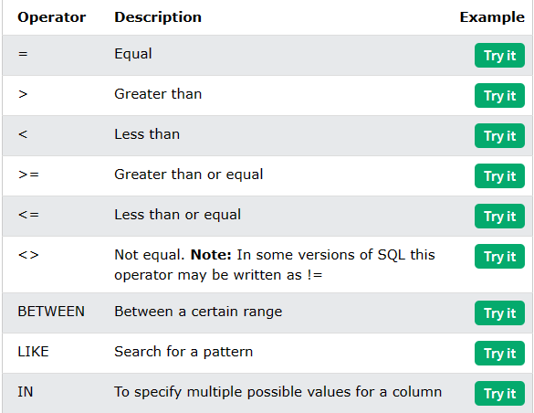
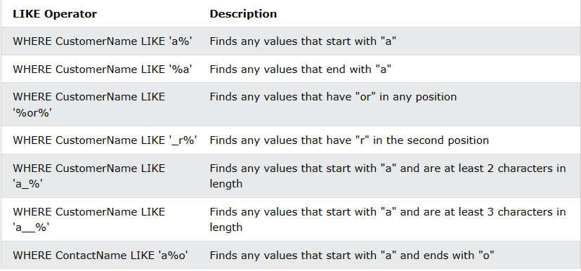
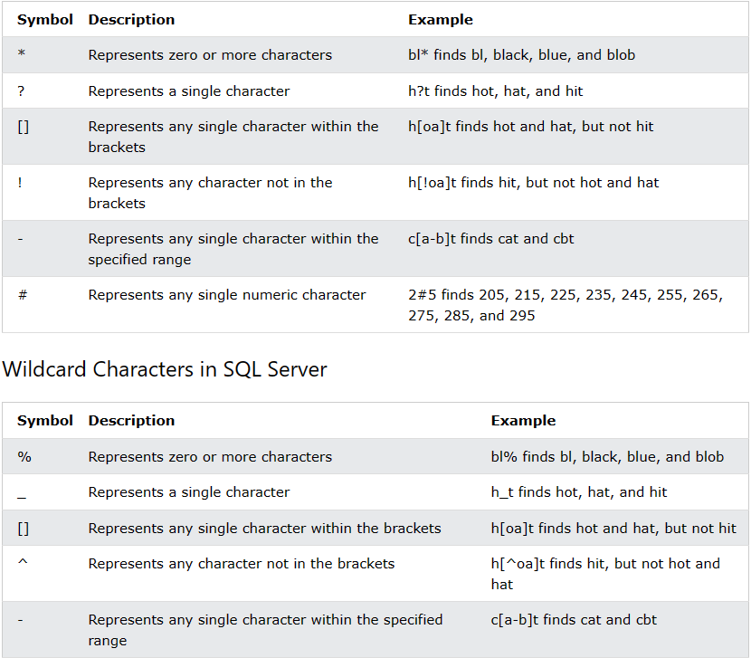

# **SQL** #

## **Tạo một database** ##

```sql
CREATE DATABASE vidu
    CHARACTER SET "utf8mb4" 
    COLLATE "utf8mb4_general_ci";
```

## **Thay đổi một database** ##

```sql
ALTER DATABASE vidu
    CHARACTER SET "utf8mb4" 
    COLLATE "utf8mb4_general_ci";
```

## **Xóa một database** ##

```sql
DROP DATABASE vidu
```

## **CREATE TABLE** ##

```sql
CREATE TABLE table_name (
    column1 datatype,
    column2 datatype,
    column3 datatype,
   ....
);
----------------------------------------------------------------
CREATE TABLE Persons (
    PersonID int,
    LastName varchar(255),
    FirstName varchar(255),
    Address varchar(255),
    City varchar(255)
);
(Copy 1 bảng)
CREATE TABLE new_table_name AS
    SELECT column1, column2,...
    FROM existing_table_name
    WHERE ....;
```

## **DROP TABLE** ##

```sql
DROP TABLE table_name;
```

## **ALTER TABLE** ##

- Sửa đổi cột và các ràng buộc trong bảng.

```sql
ALTER TABLE table_name
ADD column_name datatype;
----------------------------------------------------------------
ALTER TABLE table_name
DROP COLUMN column_name;
----------------------------------------------------------------
ALTER TABLE table_name
RENAME COLUMN old_name to new_name;
----------------------------------------------------------------
ALTER TABLE table_name
ALTER COLUMN column_name datatype;
```

## **NOT NULL on CREATE TABLE** ##

```sql
CREATE TABLE Persons (
    ID int NOT NULL,
    LastName varchar(255) NOT NULL,
    FirstName varchar(255) NOT NULL,
    Age int
);
```

## **UNIQUE** ##

- Ràng buộc đảm bảo rằng tất cả các giá trị trong một cột là khác nhau.

```sql
CREATE TABLE Persons (
    ID int NOT NULL UNIQUE,
    LastName varchar(255) NOT NULL,
    FirstName varchar(255),
    Age int
);
```

## **PRIMARY KEY** ##

```sql
CREATE TABLE Persons (
    ID int NOT NULL,
    LastName varchar(255) NOT NULL,
    FirstName varchar(255),
    Age int,
    PRIMARY KEY (ID)
);
```

## **CHECK** ##

- Sử dụng để ràng buộc giá trị.
- Để giới hạn phạm vi giá trị có thể được đặt trong một cột

```sql
CREATE TABLE Persons (
    ID int NOT NULL,
    LastName varchar(255) NOT NULL,
    FirstName varchar(255),
    Age int,
    CHECK (Age>=18)
);
```

## **DEFAULT** ##

```sql
CREATE TABLE Persons (
    ID int NOT NULL,
    LastName varchar(255) NOT NULL,
    FirstName varchar(255),
    Age int,
    City varchar(255) DEFAULT 'Sandnes'
);
```

## **[AUTO INCREMENT](https://www.w3schools.com/sql/sql_autoincrement.asp)** ##

## **[Data Types for MySQL, SQL Server, and MS Access](https://www.w3schools.com/sql/sql_datatypes.asp)** ##

## **SELECT** ##

- Được sử dụng chọn cơ sở dữ liệu .

```sql
SELECT column1, column2, ...
FROM table_name;
```

- Nếu sử dụng * thì nó sẽ liệt kê tất cả.

```sql
SELECT * FROM Customers;
```

## **SELECT DISTINCT** ##

- Nó sẽ lọc giá trị trùng lặp.

```sql
SELECT DISTINCT column1, column2, ...
FROM table_name;
```

## **SELECT COUNT** ##

- Đếm số lượng phần tử

```sql
SELECT COUNT(DISTINCT Country) FROM Customers;
```

## **WHERE** ##

- Lọc ra bảng cần truy vẫn

```sql
SELECT column1, column2, ...
FROM table_name
WHERE condition;
```



## **SQL AND, OR and NOT** ##

```sql
SELECT column1, column2, ...
FROM table_name
WHERE condition1 AND condition2 AND condition3 ...;
----------------------------------------------------
SELECT column1, column2, ...
FROM table_name
WHERE condition1 OR condition2 OR condition3 ...;
----------------------------------------------------
SELECT column1, column2, ...
FROM table_name
WHERE NOT condition;
```

## **ORDER BY** ##

- Được sử dụng dùng để sắp xếp (ASC để tăng dần default| DESC dùng để giảm dần)

```sql
SELECT column1, column2, ...
FROM table_name
ORDER BY column1, column2, ... ASC|DESC;
```

## **INSERT INTO** ##

- Chèn một hàng vào bảng và có giá trị .

```sql
INSERT INTO table_name (column1, column2, column3, ...)
VALUES (value1, value2, value3, ...);
```

## **NULL Values** ##

- Kiểm tra giá trị có phải NULL không.

```sql
SELECT column_names
FROM table_name
WHERE column_name IS NULL| IS NOT NULL;
```

## **UPDATE** ##

```sql
UPDATE table_name
SET column1 = value1, column2 = value2, ...
WHERE condition;
```

## **DELETE** ##

- Xóa hàng trong mảng .

```sql
DELETE FROM table_name WHERE condition;
```

- Xóa cả mảng

```sql
DELETE FROM table_name;
```

## **SELECT TOP, LIMIT, FETCH FIRST or ROWNUM** ##

- Lấy ra dữ liệu mảng trong top mấy giới hạn bao nhiêu hoặc bao nhiêu phần trăm .

[TÀI LIỆU THAM KHẢO](https://www.w3schools.com/sql/sql_top.asp)

## **MIN() and MAX()** ##

- Trả về giá trị lớn nhất nhỏ nhất.

```sql
SELECT MIN(column_name)
FROM table_name
WHERE condition;
-- Ex:
SELECT MIN(Price) AS SmallestPrice
FROM Products;
--Output:

SmallestPrice
2.5
```

## **COUNT(), AVG() and SUM()** ##

```sql
SELECT COUNT(column_name)
FROM table_name
WHERE condition;
----------------------------------------------------
SELECT AVG(column_name)
FROM table_name
WHERE condition;
----------------------------------------------------
SELECT SUM(column_name)
FROM table_name
WHERE condition;
```

## **LIKE** ##

- Syntax:

```sql
SELECT column1, column2, ...
FROM table_name
WHERE columnN LIKE pattern;
-- Ex:
SELECT * FROM Customers
WHERE CustomerName LIKE 'a%';
```





## **IN** ##

```sql
SELECT column_name(s)
FROM table_name
WHERE column_name IN(NOT IN) (value1, value2, ...);
----------------------------------------------------
SELECT column_name(s)
FROM table_name
WHERE column_name IN (SELECT STATEMENT);
```

## **BETWEEN** ##

```sql
SELECT column_name(s)
FROM table_name
WHERE column_name BETWEEN value1 AND value2;
```

## **Aliases** ##

- Được sử dụng để đặt tên tạm thời cho một bảng hoặc một cột trong bảng.

```sql
SELECT column_name AS alias_name
FROM table_name;
```

## **Joins(Gộp bảng)** ##

- [**TÀI LIỆU THAM KHẢO**](https://www.w3schools.com/sql/sql_join.asp)

## **Self Join** ##

- Các bảng được ghép với nhau.

```sql
SELECT column_name(s)
FROM table1 T1, table1 T2
WHERE condition;
----------------------------------------------------
--ex:
SELECT A.CustomerName AS CustomerName1, B.CustomerName AS CustomerName2, A.City
FROM Customers A, Customers B
WHERE A.CustomerID <> B.CustomerID
AND A.City = B.City
ORDER BY A.City;
```

## **UNION Operator** ##

- Kết hợp 2 bảng lại với nhau .

```sql
(Không tính lặp)
SELECT column_name(s) FROM table1
UNION
SELECT column_name(s) FROM table2;
--------------------------------
(Có tính lặp)
SELECT column_name(s) FROM table1
UNION ALL
SELECT column_name(s) FROM table2;
```

## **GROUP BY** ##

- Nhóm các hàng có cùng giá trị thành mội hàng

```sql
SELECT column_name(s)
FROM table_name
WHERE condition
GROUP BY column_name(s)
ORDER BY column_name(s);
----------------------------------------------------
--ex:
SELECT COUNT(CustomerID), Country
FROM Customers
GROUP BY Country
ORDER BY COUNT(CustomerID) DESC;
```

## **SQL HAVING** ##

- Được sử dụng khi cần điều kiện của các hàm.

```sql
SELECT column_name(s)
FROM table_name
WHERE condition
GROUP BY column_name(s)
HAVING condition
ORDER BY column_name(s);----------------------------------------------------
SELECT COUNT(CustomerID), Country
FROM Customers
GROUP BY Country
HAVING COUNT(CustomerID) > 5
ORDER BY COUNT(CustomerID) DESC;
```

## **SQL HAVING** ##

```sql
SELECT column_name(s)
FROM table_name
WHERE EXISTS
(SELECT column_name FROM table_name WHERE condition);
----------------------------------------------------------------
SELECT SupplierName
FROM Suppliers
WHERE EXISTS (SELECT ProductName FROM Products WHERE Products.SupplierID = Suppliers.supplierID AND Price < 20);
```

## **ANY and ALL** ##

```sql
(ĐK nào thỏa mãn sẽ in ra)
SELECT column_name(s)
FROM table_name
WHERE column_name operator ANY
  (SELECT column_name
  FROM table_name
  WHERE condition);
-------------------------------------------------------------------------
(Nếu tất cả thỏa mãn mới trả ra kết quả)
SELECT column_name(s)
FROM table_name
WHERE column_name operator ALL
  (SELECT column_name
  FROM table_name
  WHERE condition);
```

## **SELECT INTO** ##

- Copy dữ liệu của bảng và tạo thành bảng mới

```sql
SELECT *
INTO newtable [IN externaldb]
FROM oldtable
WHERE condition;
```

## **INSERT INTO SELECT** ##

- Sao chép dữ liệu từ một bảng và chèn nó vào một bảng khác

```sql
INSERT INTO table2 (column1, column2, column3, ...)
SELECT column1, column2, column3, ...
FROM table1
WHERE condition;
```

## **SQL CASE** ##

```sql
CASE
    WHEN condition1 THEN result1
    WHEN condition2 THEN result2
    WHEN conditionN THEN resultN
    ELSE result
END;
----------------------------------------------------------------
SELECT OrderID, Quantity,
CASE
    WHEN Quantity > 30 THEN 'The quantity is greater than 30'
    WHEN Quantity = 30 THEN 'The quantity is 30'
    ELSE 'The quantity is under 30'
END AS QuantityText
FROM OrderDetails;
```
