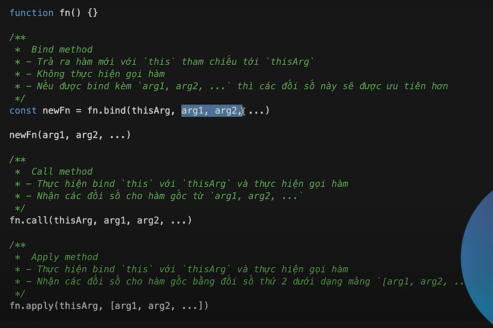

# **jQuery** #

- jQuery là một thư viện của JS
- Giúp việc lập trình JS đơn giản và ngắn gọn hơn
- Dễ dàng học hơn

## **Để thêm jQuery vào trang web** ##

- Download the jQuery library from jQuery.com
- Include jQuery from a CDN, like Google

```html
<head>
<script src="jquery-3.6.1.min.js"></script>
</head>
----------------------------------------------------------------
<head>
<script src="https://ajax.googleapis.com/ajax/libs/jquery/3.6.1/jquery.min.js"></script>
</head>
```

## **Syntax** ##

```js
Basic syntax is: $(selector).action()
----------------------------------------------------------------
Exaample:
$(document).ready(function(){
  $("button").click(function(){
    $("#test").hide();
  });
});
```

- $ : cú pháp để truy cập jQuery
- selector : Cú pháp tìm kiếm element
- action : Các hoạt động thực hiện trên phần tử

## **The Document Ready Event**

- Tất cả các event diễn ra đều nằm trong hàm nay.

```javascript
$(document).ready(function(){

  // jQuery methods go here...

});
----------------------------------------------------------------
$(function(){

  // jQuery methods go here...

});
```

- Điều này ngăn code run trước khi document được load xong.

## **jQuery Effects - Hide and Show(Các hiệu ứng)** ##

```js
$("#hide").click(function(){
  $("p").hide();
});

$("#show").click(function(){
  $("p").show();
------------------------------------------------------------------------
$(selector).hide(speed,callback);

$(selector).show(speed,callback);
});
------------------------------------------------------------------------
jQuery toggle()

- Một phương thức giữa hide và show có thể dùng cùng 1 lúc

$("button").click(function(){
  $("p").toggle();
------------------------------------------------------------------------
$(selector).toggle(speed,callback);
});
```

## **jQuery Effects - Fade(Các hiệu ứng làm mờ hiện ra và mất đi một cách dần dần)** ##

- [Tài liệu tham khảo](https://www.w3schools.com/jquery/jquery_fade.asp)

```js
$(selector).fadeIn(speed,callback);
- fadeIn()
- fadeOut()
- fadeToggle()
- fadeTo()
```

## **jQuery Effects - Slide(Các hiệu ứng làm hiện ra slide)** ##

- [Tài liệu tham khảo](https://www.w3schools.com/jquery/jquery_slide.asp)

## **jQuery Effects - Animations(Các hiệu ứng làm animations)** ##

- [Tài liệu tham khảo](https://www.w3schools.com/jquery/jquery_animate.asp)

```js
$(selector).animate({params},speed,callback);
------------------------------------------------------------------------
$("button").click(function(){
  $("div").animate({
    left: '250px',
    height: '+=150px',
    width: '+=150px'
  });
}); 
------------------------------------------------------------------------
$("button").click(function(){
  var div = $("div");
  div.animate({left: '100px'}, "slow");
  div.animate({fontSize: '3em'}, "slow");
}); 
```

## **jQuery Effects - Stop Animations(Hiệu ứng dừng chuyển động)** ##

- [Tài liệu tham khảo](https://www.w3schools.com/jquery/jquery_stop.asp)

## **jQuery HTMLL** ##

### **Get Content - text(), html(), and val()** ###

- `text()` - Sets or returns the text content of selected elements
- `html()` - Sets or returns the content of selected elements (including HTML markup)
- `val()` - Sets or returns the value of form fields

```js
$("#btn1").click(function(){
  alert("Text: " + $("#test").text());
});//Text: This is some bold text in a paragraph.
$("#btn2").click(function(){
  alert("HTML: " + $("#test").html());
});//HTML: This is some <b>bold</b> text in a paragraph.
```

### **Get Attributes - attr()** ###

```js
$("button").click(function(){
  alert($("#w3s").attr("href"));
});
```

### **Set Content - text(), html(), and val()** ###

```js
text() - Sets or returns the text content of selected elements
html() - Sets or returns the content of selected elements (including HTML markup)
val() - Sets or returns the value of form fields
------------------------------------------------------------------------
$("#btn1").click(function(){
  $("#test1").text("Hello world!");
});
$("#btn2").click(function(){
  $("#test2").html("<b>Hello world!</b>");
});
$("#btn3").click(function(){
  $("#test3").val("Dolly Duck");
});
```

### **A Callback Function for attr()** ###

```js
$("button").click(function(){
  $("#w3s").attr("href", function(i, origValue){
    return origValue + "/jquery/";
  });
});
```

### **Add New HTML Content** ###

- `append()` - Inserts content at the end of the selected elements
- `prepend()` - Inserts content at the beginning of the selected elements
- `after()`- Inserts content after the selected elements
- `before()`- Inserts content before the selected elements

- **Tạo một thẻ trong html**

```js
var txt2 = $("<p></p>").text("Text.");   // Create with jQuery
```

## **jQuery Traversing** ##

### **Traversing Up the DOM Tree** ###

```js
parent() : Trả về phần tử cha đầu tiên được chọn 
parents() : Trả về tất cả phần tử tổ tiên được chọn 
-------------------------------------------------------------------
Example: Trả về phần tử ul là tổ tiên của span
$(document).ready(function(){
  $("span").parents("ul");
});
-------------------------------------------------------------------

parentsUntil() : Trả về phần tử tổ tiên giữa 2 phần tử
Example:
$(document).ready(function(){
  $("span").parentsUntil("div");
});
-------------------------------------------------------------------
children() : method returns all direct children of the selected element
find() : method returns descendant elements of the selected element, all the way down to the last descendant.
```

### **Traversing Sideways in The DOM Tree** ###

```js
siblings() : Trả về tất cả phần tử là anh chị em
next() : Trả về phần tử anh em tiếp theo
nextAll() : Trả về tất cả phần tử anh em tiếp theo
nextUntil() : Trả về tất cả phần tử anh em giữa 2 phần tử
prev() : Ngược lại vs next là trước đó
prevAll() : Ngược lại vs nextAll
prevUntil() : Ngược lại với nextUntil
```

### **jQuery Traversing - Filtering** ###

- `first()`,`last()` and `eq()`, `filter()` and `not()`

## **jQuery Ajax** ##

[**TÀI LIỆU THAM KHẢO**](https://www.w3schools.com/jquery/jquery_ref_ajax.asp)

## **JS Browser BOM** ##

[**TÀI LIỀU THAM KHẢO**](https://www.w3schools.com/js/js_window.asp)

## **Web APIs - Introduction** ##

[**TÀI LIỀU THAM KHẢO**](https://www.w3schools.com/js/js_api_intro.asp)

## **JS AJAX (Asynchronous JavaScript And XML)** ##

- Đọc dữ liệu từ máy chủ web - sau khi trang đã được tải
- Cập nhật trang web mà không cần tải lại trang
- Gửi dữ liệu đến máy chủ web - ở chế độ nền


### **AJAX - The XMLHttpRequest Object** ###

[**TÀI LIỀU THAM KHẢO**](https://www.w3schools.com/js/js_ajax_http.asp)

## **JS JSON** ##

### **JSON.parse() (Chuyển json sang đối tượng trong JS)** ###

```js
const obj = JSON.parse('{"name":"John", "age":30, "city":"New York"}');
```

### **JSON.stringify() (Chuyển đối tượng trong JS sang JSon)** ###

```js
const obj = {name: "John", age: 30, city: "New York"};
const myJSON = JSON.stringify(obj);
```

## **Tìm hiểu PROMISE trong JS** ##

- *sync ( Đồng bộ )* : Là code vt trước chạy trước vt sau chạy sau.
- *aync ( Bất đồng bộ )* :

```js
- hàm bất đồng bộ:
  - setTimeout, setInterval, fetch,XMLHttpRequest, file reading,....
```

- Syntax:

```javascript
// trạng thái 
  // 1. pendding : xảy ra khi ko resolve hay reject
  // 2. Fulfilled : xảy ra khi trạng thái thành công
  // 3. reject : xảy ra khi thất bại
var promise = new Promise(
  function (resolve, reject) {
    //logic
    // Thành công : resolve ()
    // Thất bại : reject ()
  }
);

promise 
  .then(function (){
    // hoạt động khi thành công
  })
  .catch(function (){
    // hoạt động khi thất bại

  })
  .finally(function(){
    // một trong 2 cái trên hoạt động thì finally hoạt động
  })
```

- **Promise có thể nhận theo dạng chuỗi để thay thế cho callback hell**

```javascript
var promise = new Promise(
  function (resolve, reject) {
    resolve ()
    // Thất bại : reject ()
  }
);

promise 
  .then(function (){
    return 1;
  })
  .then(function (data){
    console.log(data);
    return 2;
  })
  .then(function (data){
    console.log(data);
    return 3;
  })
  .then(function (data){
    console.log(data);
    return 4;
  })
  .catch(function (){
    // hoạt động khi thất bại

  })
  .finally(function(){
    // một trong 2 cái trên hoạt động thì finally hoạt động
  })
  Output:
        1
        2
        3
```

```javascript
function sleep(ms){
  return new Promise((resolve, reject) => {
    setTimeout(resolve, ms);
  });
}
sleep(1000);
  .then(function(){
    console.log(1);
    return sleep(1000);
  })
  .then(function(){
    console.log(2);
    return sleep(1000);
  })
  .then(function(){
    console.log(3);
    return sleep(1000);
  })
```

- **Promise methods (resolve, reject, all)**
  - Nếu muốn chạy đồng thời 2 kết quả

```javascript
var promise = new Promise((resolve)=>{
  setTimeout(function(){
    resolve([1]);},2000);
  });

var promise2 = new Promise((resolve)=>{
  setTimeout(function(){
    resolve([2,3]);},5000);
  });

Promise.all([promise, promise2])
  .then(function(result){
    var result1= result[0];
    var result2 = result[1];
    console.log(result1.concat(result2));
  })
  //output:(3) [1, 2, 3]
```

## **ES6 - ( ECMAScript 6 )** ##

- **Var / Let, const**:
  - Scope ( Phạm vi truy cập ):
    - Code block: if else, loop, {}, ....
    - Phạm vi truy cập `let, const` chỉ trong block, còn `var`có thể sử sử dụng ngoài cả block.
  - Hosting ( Nó có thể định nghĩa biên lên trên đầu )
    - Chỉ có var thực hiện được còn let , const thì không

  ```js
  a=1;
  var a;
  ```

- **Arrow function - ( Hàm mũi tên )**:

```js
const sum = (a,b)=>{
  return a+b;
}
sum(2,3);
```

- **JS Class**

```js
class course {
  constructor(name, price){
    this.name=name;
    this.price=price;
  }
}
```

- **JS Class Inheritance - ( Kế thừa )**

```js
class Car {
  constructor(brand) {
    this.carname = brand;
  }
  present() {
    return 'I have a ' + this.carname;
  }
}

class Model extends Car {
  constructor(brand, mod) {
    super(brand);
    this.model = mod;
  }
  show() {
    return this.present() + ', it is a ' + this.model;
  }
}

let myCar = new Model("Ford", "Mustang");
document.getElementById("demo").innerHTML = myCar.show();
```

- **Destructuring**

  - Lấy dữ liệu từ mảng

```js
var name = ['kien','juy', 'hoa'];
var [a,b,c]=name;
console.log(a,b,c);
---------------------------------------------------------------------
// Destructure properties into variables
const note = {
id: 1,
title: 'My first note',
date: '01/01/1970',
}    
const { id, title, date } = note
console.log(id)
console.log(title)
console.log(date)
Output:
1
My first note
01/01/1970
--------------------------------------------------------------------
// Kết hợp cả object và array
const note = {
title: 'My first note',
author: {
  firstName: 'Sherlock',
  lastName: 'Holmes',
},
tags: ['personal', 'writing', 'investigations'],
}
const {
  title,
  date = new Date(),
  author: { firstName },
  tags: [personalTag, writingTag],
} = note
console.log(date)
Output
Fri May 08 2020 23:53:49 GMT-0500 (Central Daylight Time
```

- **Spread ( ... )**
  - Có thể được sử dụng để tạo các bản sao đơn giản của cấu trúc dữ liệu để dễ thao tác dữ liệu.

```js
// Create an Array
const tools = ['hammer', 'screwdriver']
const otherTools = ['wrench', 'saw']

// Concatenate tools and otherTools together
const allTools = tools.concat(otherTools)

// Unpack the tools Array into the allTools Array
const allTools = [...tools, ...otherTools]

console.log(allTools)

Output
["hammer", "screwdriver", "wrench", "saw"]


// Tạo mảng từ chuôĩ
const string = 'hello'
const stringArray = [...string]
console.log(stringArray)

Output
["h", "e", "l", "l", "o"]
// OBJECT

// Create an object and a copied object with spread
const originalObject = { enabled: true, darkMode: false }
const secondObject = { ...originalObject }

console.log(secondObject)

Output
{enabled: true, darkMode: false}
```

- **Rest parameters**

```js
const [firstTool, ...rest] = ['hammer', 'screwdriver', 'wrench']

console.log(firstTool)
console.log(rest)

Output
hammer
["screwdriver", "wrench"]
```

- **Module trong javascript ES6**
  - `Import` : nạp vào
  - `Export` : in ra

```js
// myMath.js

// Default export
export default function add(x,y){
    return x + y
}

// Normal export
export function subtract(x,y){
    return x - y
}

// Multiple exports
function multiply(x,y){
    return x * y
}
function duplicate(x){
    return x * 2
}
export {
    multiply,
    duplicate
}
-----------------------------------------------------------------
// main.js
import add, { subtract, multiply, duplicate } from './myMath.js';

console.log(add(6, 2)); // 8 
console.log(subtract(6, 2)) // 4
console.log(multiply(6, 2)); // 12
console.log(duplicate(5)) // 10

// index.html
<script type="module" src="main.js"></script>


```

## **Optional chaining (?.)** ##

- [**TÀI LIỆU THAM KHẢO**](https://developer.mozilla.org/en-US/docs/Web/JavaScript/Reference/Operators/Optional_chaining)

## **IIFE - (Immediately Invoked Function Expression)** ##

- Hiểu đơn giản một hàm tạp ra được gọi và chạy ngay tức thì .

```js
(function(){
  console.log('NOW');
})()
```

- Có tính private

```js
(function myFunction(){
  console.log("NOW");
})()
myFunction();
//output:Error
```

## **Value types & Reference types** ##

- **`Reference types`** (Tham chiếu) :
  - object
  - array
  - function
- **`Value types`** (Tham trị các kiểu dữ liệu còn lại)
  - number
  - string
  - ...

## **Fn.bind()** ##

- Trả về một this mới .
- bind là phương thức, một đối tượng có thể mượn một phương thức từ một đối tượng khác.

```js
const person = {
  firstName:"John",
  lastName: "Doe",
  fullName: function () {
    return this.firstName + " " + this.lastName;
  }
}

const member = {
  firstName:"Hege",
  lastName: "Nilsen",
}

let fullName = person.fullName.bind(member);
```

## **Fn.call()** ##

- Là phương thức dùng để gọi hàm và cũng có thể bind this cho hàm

```js
const person = {
  fullName: function() {
    return this.firstName + " " + this.lastName;
  }
}
const person1 = {
  firstName:"John",
  lastName: "Doe"
}
const person2 = {
  firstName:"Mary",
  lastName: "Doe"
}

// This will return "John Doe":
person.fullName.call(person1);
```

## **Fn.apply()** ##

- Tương tự  call




## **Array iteration** ##

### **forEach()** ###

- foreach : Duyệt qua từng phần tử của mảng.

```javascript
// Arrow function
forEach((element) => { /* … */ })
forEach((element, index) => { /* … */ })
forEach((element, index, array) => { /* … */ })

// Callback function
forEach(callbackFn)
forEach(callbackFn, thisArg)

// Inline callback function
forEach(function (element) { /* … */ })
forEach(function (element, index) { /* … */ })
forEach(function (element, index, array) { /* … */ })
forEach(function (element, index, array) { /* … */ }, thisArg)
-----------------------------------------------------------
const ratings = [5, 4, 5];
let sum = 0;

const sumFunction = async (a, b) => a + b;

ratings.forEach(async (rating) => {
  sum = await sumFunction(sum, rating);
});

console.log(sum);
// Naively expected output: 14
// Actual output: 0
```

### **every()** ###

- Thường dùng để kiểm tra tất cả phần tử với một điều kiền chung. Tất cả phần tử đều đúng với điều kiện mới trả về true.

```javascript
// Arrow function
every((element) => { /* … */ })
every((element, index) => { /* … */ })
every((element, index, array) => { /* … */ })

// Callback function
every(callbackFn)
every(callbackFn, thisArg)

// Inline callback function
every(function (element) { /* … */ })
every(function (element, index) { /* … */ })
every(function (element, index, array) { /* … */ })
every(function (element, index, array) { /* … */ }, thisArg)
-------------------------------------------------------------
// ---------------
// Modifying items
// ---------------
let arr = [1, 2, 3, 4];
arr.every((elem, index, arr) => {
  arr[index + 1]--;
  console.log(`[${arr}][${index}] -> ${elem}`);
  return elem < 2;
});

// Loop runs for 3 iterations, but would
// have run 2 iterations without any modification
//
// 1st iteration: [1,1,3,4][0] -> 1
// 2nd iteration: [1,1,2,4][1] -> 1
// 3rd iteration: [1,1,2,3][2] -> 2

// ---------------
// Appending items
// ---------------
arr = [1, 2, 3];
arr.every((elem, index, arr) => {
  arr.push("new");
  console.log(`[${arr}][${index}] -> ${elem}`);
  return elem < 4;
});

// Loop runs for 3 iterations, even after appending new items
//
// 1st iteration: [1, 2, 3, new][0] -> 1
// 2nd iteration: [1, 2, 3, new, new][1] -> 2
// 3rd iteration: [1, 2, 3, new, new, new][2] -> 3

// ---------------
// Deleting items
// ---------------
arr = [1, 2, 3, 4];
arr.every((elem, index, arr) => {
  arr.pop();
  console.log(`[${arr}][${index}] -> ${elem}`);
  return elem < 4;
});

// Loop runs for 2 iterations only, as the remaining
// items are `pop()`ed off
//
// 1st iteration: [1,2,3][0] -> 1
// 2nd iteration: [1,2][1] -> 2
```

### **some()** ###

- some : Thường dùng để kiểm tra tất cả phần tử với một điều kiền chung. Nếu chỉ cần 1 phần tử đúng trả về True

```javascript
// Arrow function
some((element) => { /* … */ })
some((element, index) => { /* … */ })
some((element, index, array) => { /* … */ })

// Callback function
some(callbackFn)
some(callbackFn, thisArg)

// Inline callback function
some(function (element) { /* … */ })
some(function (element, index) { /* … */ })
some(function (element, index, array) { /* … */ })
some(function (element, index, array) { /* … */ }, thisArg)
----------------------------------------------------------
function isBiggerThan10(element, index, array) {
  return element > 10;
}

[2, 5, 8, 1, 4].some(isBiggerThan10); // false
[12, 5, 8, 1, 4].some(isBiggerThan10); // true
```

### **find()** ###

- find : Duyệt qua từng phần tử của mảng. Tìm kiếm phần tử. Kết quả chỉ trả về một phần tử dù có 2 phần tử giống nhau.

```javascript
// Arrow function
find((element) => { /* … */ })
find((element, index) => { /* … */ })
find((element, index, array) => { /* … */ })

// Callback function
find(callbackFn)
find(callbackFn, thisArg)

// Inline callback function
find(function (element) { /* … */ })
find(function (element, index) { /* … */ })
find(function (element, index, array) { /* … */ })
find(function (element, index, array) { /* … */ }, thisArg)
-------------------------------------------------------------
const inventory = [
  { name: "apples", quantity: 2 },
  { name: "bananas", quantity: 0 },
  { name: "cherries", quantity: 5 },
];

function isCherries(fruit) {
  return fruit.name === "cherries";
}

console.log(inventory.find(isCherries));
// { name: 'cherries', quantity: 5 }
```

### **filter()** ###

- filter : Giống như find nhưng kết quả trả về tất cả phần tử cần tìm.

```javascript
// Arrow function
filter((element) => { /* … */ })
filter((element, index) => { /* … */ })
filter((element, index, array) => { /* … */ })

// Callback function
filter(callbackFn)
filter(callbackFn, thisArg)

// Inline callback function
filter(function (element) { /* … */ })
filter(function (element, index) { /* … */ })
filter(function (element, index, array) { /* … */ })
filter(function (element, index, array) { /* … */ }, thisArg)
----------------------------------------------------------
const array = [-3, -2, -1, 0, 1, 2, 3, 4, 5, 6, 7, 8, 9, 10, 11, 12, 13];

function isPrime(num) {
  for (let i = 2; num > i; i++) {
    if (num % i === 0) {
      return false;
    }
  }
  return num > 1;
}

console.log(array.filter(isPrime)); // [2, 3, 5, 7, 11, 13]
```

### **map()** ###

- map : Được sử dụng khi cần làm việc thay đổi element mà không cần thay đổi mảng ban đầu.

```javascript
// Arrow function
map((element) => { /* … */ })
map((element, index) => { /* … */ })
map((element, index, array) => { /* … */ })

// Callback function
map(callbackFn)
map(callbackFn, thisArg)

// Inline callback function
map(function (element) { /* … */ })
map(function (element, index) { /* … */ })
map(function (element, index, array) { /* … */ })
map(function (element, index, array) { /* … */ }, thisArg)
--------------------------------------------------------
const numbers = [1, 4, 9];
const doubles = numbers.map((num) => num * 2);

console.log(doubles); // [2, 8, 18]
console.log(numbers); // [1, 4, 9]
```

### **reduce()** ###

-

```javascript
// Arrow function
reduce((accumulator, currentValue) => { /* … */ })
reduce((accumulator, currentValue, currentIndex) => { /* … */ })
reduce((accumulator, currentValue, currentIndex, array) => { /* … */ })

reduce((accumulator, currentValue) => { /* … */ }, initialValue)
reduce((accumulator, currentValue, currentIndex) => { /* … */ }, initialValue)
reduce((accumulator, currentValue, currentIndex, array) => { /* … */ }, initialValue)

// Callback function
reduce(callbackFn)
reduce(callbackFn, initialValue)

// Inline callback function
reduce(function (accumulator, currentValue) { /* … */ })
reduce(function (accumulator, currentValue, currentIndex) { /* … */ })
reduce(function (accumulator, currentValue, currentIndex, array) { /* … */ })

reduce(function (accumulator, currentValue) { /* … */ }, initialValue)
reduce(function (accumulator, currentValue, currentIndex) { /* … */ }, initialValue)
reduce(function (accumulator, currentValue, currentIndex, array) { /* … */ }, initialValue)
-----------------------------------------------------------
const message = ["JavaScript ", "is ", "fun."];

// function to join each string elements
function joinStrings(accumulator, currentValue) {
  return accumulator + currentValue;
}

// reduce join each element of the string
let joinedString = message.reduce(joinStrings);
console.log(joinedString);

// Output: JavaScript is fun.
---------------------------------------------------------
let people = [
  { name: "John", age: 21 },
  { name: "Oliver", age: 55 },
  { name: "Michael", age: 55 },
  { name: "Dwight", age: 19 },
  { name: "Oscar", age: 21 },
  { name: "Kevin", age: 55 },
];

function groupBy(objectArray, property) {
  return objectArray.reduce(function (accumulator, currentObject) {
    let key = currentObject[property];
    if (!accumulator[key]) {
      accumulator[key] = [];
    }
    accumulator[key].push(currentObject);
    return accumulator;
  }, {});
}

let groupedPeople = groupBy(people, "age");
console.log(groupedPeople);
//Output:
// {
//   '19': [ { name: 'Dwight', age: 19 } ],
//   '21': [ { name: 'John', age: 21 }, { name: 'Oscar', age: 21 } ],
//   '55': [
//     { name: 'Oliver', age: 55 },
//     { name: 'Michael', age: 55 },
//     { name: 'Kevin', age: 55 }
//   ]
// }
```

### **ASYNC AWAIT** ###

- 3 cách sử lý bất đồng bộ CALLBACK, PROMISES, ASYNC AWAIT

```javascript
// cách 1: 
    function getJSON() {

        // To make the function blocking we manually create a Promise.
        return new Promise( function(resolve) {
            axios.get('https://tutorialzine.com/misc/files/example.json')
                .then( function(json) {

                    // The data from the request is available in a .then block
                    // We return the result using resolve.
                    resolve(json);
                });
        });
    }
    // cách 2:
    // Async/Await approach

    // The async keyword will automatically create a new Promise and return it.
    async function getJSONAsync() {

        // The await keyword saves us from having to write a .then() block.
        let json = await axios.get('https://tutorialzine.com/misc/files/example.json');

        // The result of the GET request is available in the json variable.
        // We return it just like in a regular synchronous function.
        return json;
    }
-------------------------------------------------------------
  const getSuggestions = async () => {
  const wordQuery = inputField.value;
  const endpoint = `${url}${queryParams}${wordQuery}`;
  try{
    const response = await fetch(endpoint, {cache: 'no-cache'});
    if(response.ok){
      const jsonResponse = await response.json()
    }
  }
  catch(error){
    console.log(error)
  }
}
```
